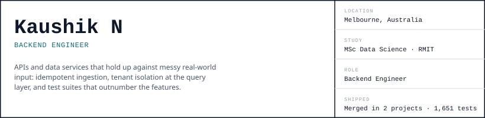
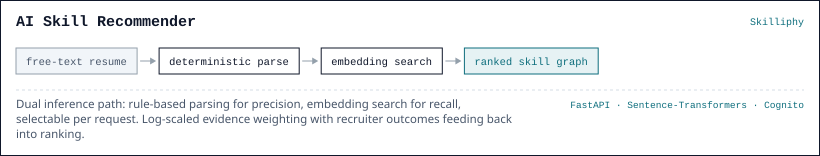
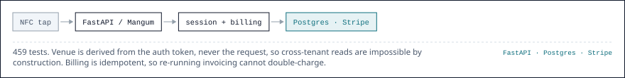
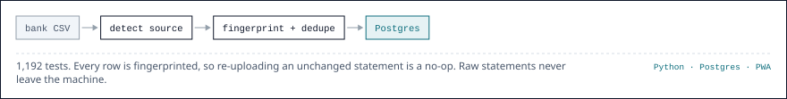
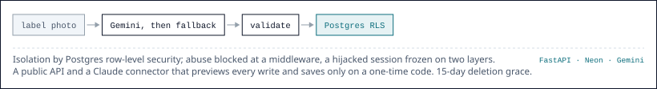
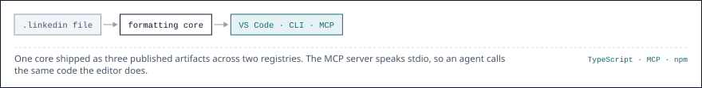

<picture><source media="(prefers-color-scheme: dark)" srcset="header-dark.svg"></picture>

<picture><source media="(prefers-color-scheme: dark)" srcset="sec-oss-dark.svg"></picture>

<picture><source media="(prefers-color-scheme: dark)" srcset="sec-exp-dark.svg"></picture>

<picture><source media="(prefers-color-scheme: dark)" srcset="exp-bar-dark.svg"></picture>

<picture><source media="(prefers-color-scheme: dark)" srcset="exp-body-dark.svg"></picture>

<picture><source media="(prefers-color-scheme: dark)" srcset="sec-prj-dark.svg"></picture>

<a href="https://mingle-hub.vercel.app/fifty-five-bar/1"><picture><source media="(prefers-color-scheme: dark)" srcset="p01-bar-dark.svg"></picture></a><a href="https://github.com/MrTig-afk/MingleHub"><picture><source media="(prefers-color-scheme: dark)" srcset="p01-ic1-dark.svg"></picture></a>

<picture><source media="(prefers-color-scheme: dark)" srcset="p01-body-dark.svg"></picture>

<a href="https://github.com/MrTig-afk/FinanceTracker"><picture><source media="(prefers-color-scheme: dark)" srcset="p02-bar-dark.svg"></picture></a><a href="https://github.com/MrTig-afk/FinanceTracker"><picture><source media="(prefers-color-scheme: dark)" srcset="p02-ic1-dark.svg"></picture></a>

<picture><source media="(prefers-color-scheme: dark)" srcset="p02-body-dark.svg"></picture>

<a href="https://nutritional-tracker-delta.vercel.app/"><picture><source media="(prefers-color-scheme: dark)" srcset="p03-bar-dark.svg"></picture></a><a href="https://github.com/MrTig-afk/NutritionalTracker"><picture><source media="(prefers-color-scheme: dark)" srcset="p03-ic1-dark.svg"></picture></a>

<picture><source media="(prefers-color-scheme: dark)" srcset="p03-body-dark.svg"></picture>

<a href="https://marketplace.visualstudio.com/items?itemName=kaushiknaru.linkedin-formatter"><picture><source media="(prefers-color-scheme: dark)" srcset="p04-bar-dark.svg"></picture></a><a href="https://www.npmjs.com/package/linkedin-fmt"><picture><source media="(prefers-color-scheme: dark)" srcset="p04-ic1-dark.svg"></picture></a><a href="https://github.com/MrTig-afk/linkedin-formatter"><picture><source media="(prefers-color-scheme: dark)" srcset="p04-ic2-dark.svg"></picture></a>

<picture><source media="(prefers-color-scheme: dark)" srcset="p04-body-dark.svg"></picture>

<a href="https://portfolio-mrtig-afks-projects.vercel.app"><picture><source media="(prefers-color-scheme: dark)" srcset="cta-dark.svg"></picture></a>
