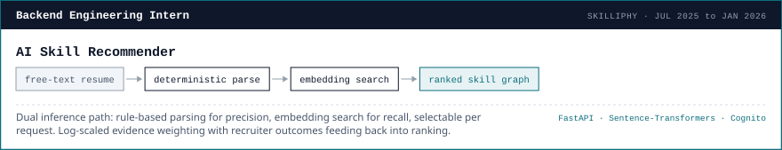
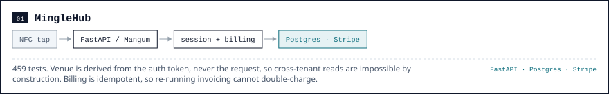
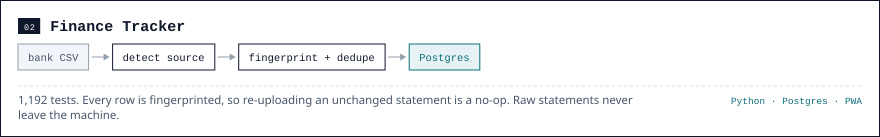
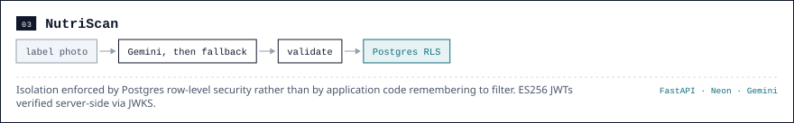
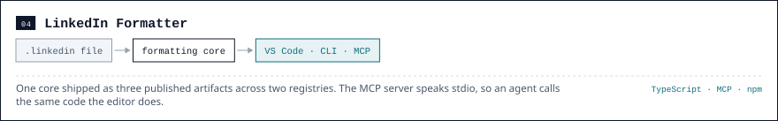

<picture>
  <source media="(prefers-color-scheme: dark)" srcset="header-dark.svg">
  
</picture>

<picture>
  <source media="(prefers-color-scheme: dark)" srcset="label-oss-dark.svg">
  
</picture>

<picture>
  <source media="(prefers-color-scheme: dark)" srcset="label-experience-dark.svg">
  
</picture>

<picture>
  <source media="(prefers-color-scheme: dark)" srcset="experience-dark.svg">
  
</picture>

<picture>
  <source media="(prefers-color-scheme: dark)" srcset="label-work-dark.svg">
  
</picture>

<picture>
  <source media="(prefers-color-scheme: dark)" srcset="project-01-dark.svg">
  
</picture>

[Live demo](https://mingle-hub.vercel.app/fifty-five-bar/1) &nbsp;·&nbsp; [Code](https://github.com/MrTig-afk/MingleHub)

<picture>
  <source media="(prefers-color-scheme: dark)" srcset="project-02-dark.svg">
  
</picture>

[Code](https://github.com/MrTig-afk/FinanceTracker)

<picture>
  <source media="(prefers-color-scheme: dark)" srcset="project-03-dark.svg">
  
</picture>

[Live](https://nutritional-tracker-delta.vercel.app/) &nbsp;·&nbsp; [Code](https://github.com/MrTig-afk/NutritionalTracker)

<picture>
  <source media="(prefers-color-scheme: dark)" srcset="project-04-dark.svg">
  
</picture>

[Marketplace](https://marketplace.visualstudio.com/items?itemName=kaushiknaru.linkedin-formatter) &nbsp;·&nbsp; [npm](https://www.npmjs.com/package/linkedin-fmt) &nbsp;·&nbsp; [MCP](https://www.npmjs.com/package/linkedin-formatter-mcp) &nbsp;·&nbsp; [Code](https://github.com/MrTig-afk/linkedin-formatter)

<picture>
  <source media="(prefers-color-scheme: dark)" srcset="cta-dark.svg">
  
</picture>
